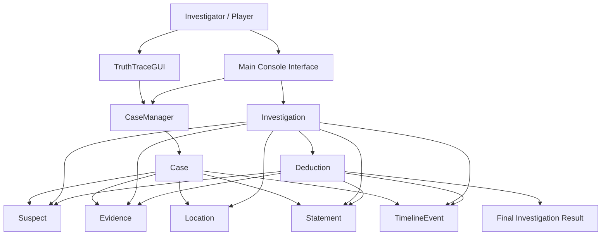

# System Architecture

TruthTrace uses a modular object-oriented architecture separating the interface, case entities, investigation control and deduction logic.

## Main Layers

### Presentation Layer
- `TruthTraceGUI`
- `Main`

### Case/Data Layer
- `Case`
- `CaseManager`
- `Suspect`
- `Evidence`
- `Location`
- `Statement`
- `TimelineEvent`

### Investigation Logic Layer
- `Investigation`
- `Deduction`
