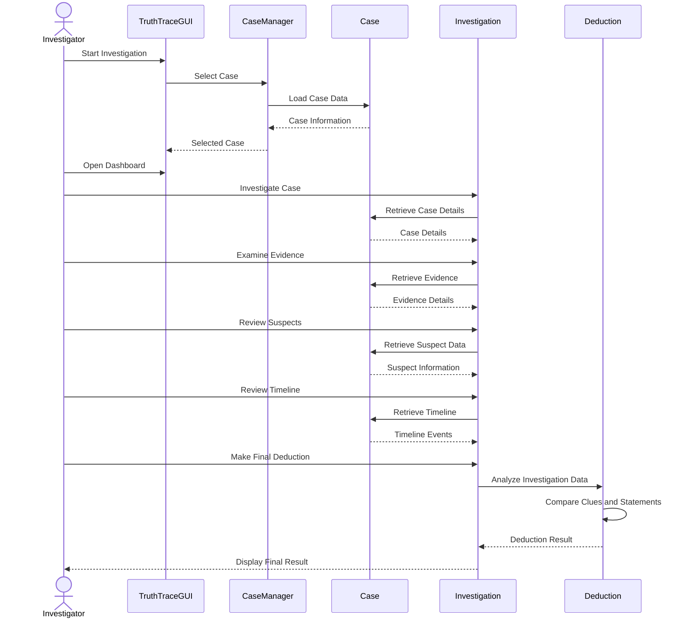

# Sequence Diagram

```mermaid
sequenceDiagram
    actor Player as Investigator
    participant GUI as TruthTraceGUI
    participant CM as CaseManager
    participant Case as Case
    participant Inv as Investigation
    participant Ded as Deduction

    Player->>GUI: Start Investigation
    GUI->>CM: Select Case
    CM->>Case: Load Case Data
    Case-->>CM: Case Information
    CM-->>GUI: Selected Case

    Player->>GUI: Open Dashboard
    Player->>Inv: Investigate Case
    Inv->>Case: Retrieve Case Details
    Case-->>Inv: Case Details

    Player->>Inv: Examine Evidence
    Inv->>Case: Retrieve Evidence
    Case-->>Inv: Evidence Details

    Player->>Inv: Review Suspects
    Inv->>Case: Retrieve Suspect Data
    Case-->>Inv: Suspect Information

    Player->>Inv: Review Timeline
    Inv->>Case: Retrieve Timeline
    Case-->>Inv: Timeline Events

    Player->>Inv: Make Final Deduction
    Inv->>Ded: Analyze Investigation Data
    Ded->>Ded: Compare Clues and Statements
    Ded-->>Inv: Deduction Result
    Inv-->>Player: Display Final Result
```
