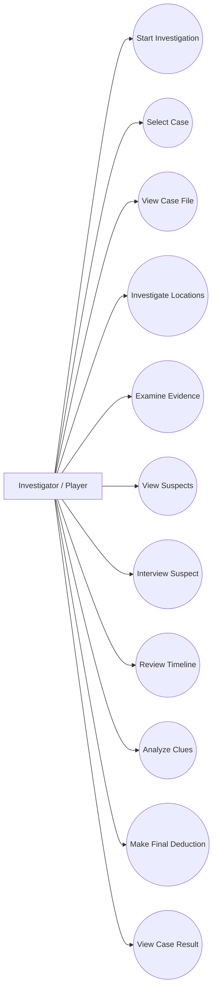

# Use Case Diagram

```mermaid
flowchart LR
    A[Investigator / Player]
    UC1((Start Investigation))
    UC2((Select Case))
    UC3((View Case File))
    UC4((Investigate Locations))
    UC5((Examine Evidence))
    UC6((View Suspects))
    UC7((Interview Suspect))
    UC8((Review Timeline))
    UC9((Analyze Clues))
    UC10((Make Final Deduction))
    UC11((View Case Result))

    A --> UC1
    A --> UC2
    A --> UC3
    A --> UC4
    A --> UC5
    A --> UC6
    A --> UC7
    A --> UC8
    A --> UC9
    A --> UC10
    A --> UC11
```

## Actor

**Investigator / Player** interacts with the application to investigate a fictional case and submit a final deduction.
