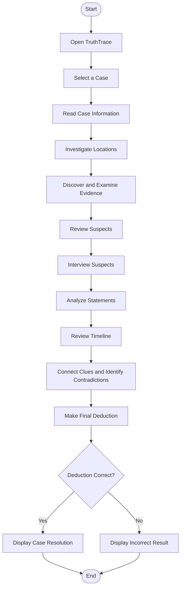

# Process Workflow

## Workflow Description

1. Open TruthTrace.
2. Select a fictional investigation case.
3. Read the case information.
4. Investigate locations.
5. Discover and examine evidence.
6. Review and interview suspects.
7. Analyze statements.
8. Review the timeline.
9. Connect clues and identify contradictions.
10. Make the final deduction.
11. Display the investigation result.
